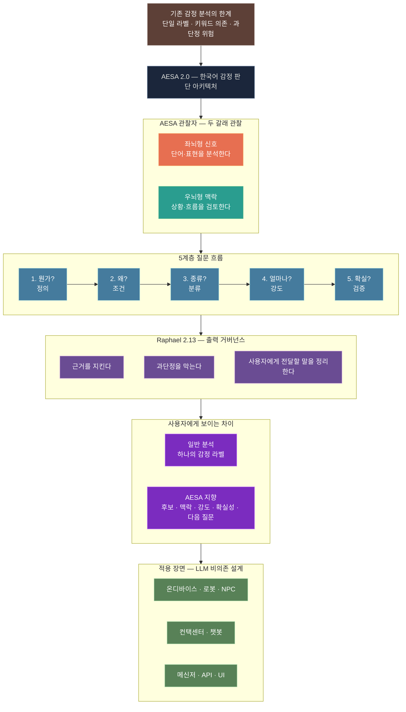

# AESA — 한국어 복합 감정·맥락 신호 분석 엔진

> 비정형 한국어 텍스트 안에 드러나는 감정 후보, 맥락, 강도, 시간 흐름, 관계 신호를 구조화하는 AI 분석 프로젝트입니다.

**Repository**: https://github.com/madecompass/AESA

AESA(Advanced Emotion & Sentiment Analyzer)는 한국어 문장에서 단순 긍정/부정을 넘어, 복합 감정·강도·전이·상황 맥락·감정 간 관계를 다축적으로 분석하기 위한 포트폴리오형 AI 프로토타입입니다.

이 프로젝트는 전직 퍼블리셔의 언어·맥락 감각을 바탕으로, AI 모델의 결과를 실제 서비스에서 활용 가능한 구조로 정리하는 것을 목표로 합니다.

> 본 프로젝트는 심리 진단 도구가 아니며, 텍스트 기반 감정·맥락 신호를 분석 후보로 구조화하는 실험적 시스템입니다.

## Executive Summary

- **AESA 1.0**은 11개 분석 관점과 FastAPI/UI 데모를 갖춘 공개 프로토타입입니다.
- **AESA 1.0 데모 영상과 스크린샷**은 현재 공개 구현물의 결과 화면을 보여줍니다.
- **AESA 2.0**은 1.0의 한계를 바탕으로 감정 후보, 근거, 흐름, 불확실성, 출력 안전성을 다루는 schema-driven R&D 트랙으로 고도화 중입니다.
- 공개 저장소에는 포트폴리오용 프로토타입과 개념 수준 설명만 포함하며, 내부 schema, rule, answer-key, prompt 전문은 공개하지 않습니다.

---

## Project Overview

| 항목 | 내용 |
|------|------|
| **목표** | 한국어 텍스트의 복합 감정·맥락 신호 분석 |
| **핵심 방향** | 단일 감정 라벨이 아니라 감정 후보, 근거, 흐름, 불확실성을 함께 구조화 |
| **구현 방식** | Python 기반 모듈형 분석 파이프라인 + FastAPI 서비스 구조 |
| **현재 상태** | AESA 1.0 프로토타입 공개 / AESA 2.0 schema-driven scaffold 내부 고도화 중 |
| **역할** | 기획, 구조 설계, Python 프로토타입 구현, API/데모 구성, 출력 거버넌스 설계 |
| **용도** | 포트폴리오, 학습, AI 서비스 구조 실험 |

---

## Why AESA

한국어 감정 표현은 단어 하나나 긍·부정 점수만으로 설명하기 어렵습니다.

하나의 문장 안에서도 여러 감정이 동시에 존재할 수 있고, 같은 표현도 문맥·상황·관계·시간 흐름에 따라 다르게 해석될 수 있습니다.

AESA는 이러한 문제의식에서 출발했습니다.

- **복합 감정**: 하나의 입력 안에 여러 감정 후보가 동시에 존재할 수 있음
- **맥락 의존성**: 감정은 단어뿐 아니라 상황, 관계, 시간 흐름에 따라 달라짐
- **전이와 흐름**: 감정은 고정된 라벨이 아니라 변화하는 흐름으로 나타남
- **서비스 적용성**: 모델 결과는 실제 화면, API, 사용자 경험에 맞게 구조화되어야 함
- **안전한 해석**: 감정 분석 결과는 진단이 아니라 관찰 가능한 후보와 근거로 제시되어야 함

AESA 2.0에서는 이 방향을 한 단계 확장하여, 감정의 단순 분류보다 **감정의 결**을 구조화하는 것을 목표로 합니다.

여기서 “감정의 결”은 단일 정답 라벨이 아니라, 텍스트 안에 함께 드러나는 감정 후보, 강도, 맥락, 시간 흐름, 관계 신호, 충돌 가능성, 불확실성의 조합을 의미합니다.

---

## Tech Stack

| Category | Technology |
|----------|------------|
| Language | Python 3.11+ |
| API | FastAPI, Uvicorn |
| Deep Learning | PyTorch 2.x |
| NLP | Sentence-Transformers, Transformers (HuggingFace) |
| Korean NLP | KSS, Kiwipiepy |
| Data | Pandas, NumPy, JSON/JSONL |
| Frontend | HTML5, CSS3, Vanilla JS |
| Architecture | Modular pipeline, structured payload, service-oriented result format |

---

## Repository Structure

아래 구조는 공개 GitHub 저장소 기준의 요약 구조입니다. AESA 2.0의 내부 schema·evaluation scaffold와 비공개 rule/answer-key 자산은 공개 저장소에 포함하지 않습니다.

```text
AESA/
├── madeaesa/                  # AESA 1.0 공개 프로토타입 / 데모 번들
├── README.md                  # 포트폴리오용 프로젝트 소개
├── LICENSE
└── requirements.txt
```

내부 개발 환경에서는 분석 모듈, FastAPI serving, 오케스트레이터, UI 자산이 역할별로 분리되어 있으며, 공개 README에서는 핵심 구조만 요약합니다.

---

## AESA 1.0 — Public Prototype

AESA 1.0은 현재 공개 저장소에서 확인할 수 있는 구현 중심 프로토타입입니다. 감정 분석을 단일 모델 결과에만 의존하지 않고, 여러 분석 관점으로 나누어 처리하는 구조를 실험했습니다.

| # | 모듈 | 역할 |
|---|------|------|
| 1 | **PatternExtractor** | 감정 표현 패턴과 흐름 단서 추출 |
| 2 | **LinguisticMatcher** | 언어적 특성 기반 감정 단서 매칭 |
| 3 | **IntensityAnalyzer** | 감정 강도 측정 및 임베딩 기반 분석 |
| 4 | **ContextExtractor** | 문맥 기반 감정 후보 추론 |
| 5 | **TransitionAnalyzer** | 감정 전이 패턴 분석 |
| 6 | **TimeSeriesAnalyzer** | 시간 흐름에 따른 감정 변화 추적 |
| 7 | **SituationAnalyzer** | 상황 맥락 기반 감정 단서 분석 |
| 8 | **PsychologicalAnalyzer** | 텍스트 내 심리적 경향과 인지 단서 분석 |
| 9 | **WeightCalculator** | 감정 후보별 가중치 계산 |
| 10 | **ComplexAnalyzer** | 복합 감정 통합 분석 |
| 11 | **EmotionRelationshipAnalyzer** | 감정 간 관계성 분석 |

---

## AESA 1.0 Architecture

```text
[입력 텍스트]
      │
      ▼
[Payload 생성 / 입력 정규화]
      │
      ▼
[EmotionPipelineOrchestrator]
      │
      ├─→ [PatternExtractor]
      ├─→ [LinguisticMatcher]
      ├─→ [IntensityAnalyzer]
      ├─→ [ContextExtractor]
      ├─→ [TransitionAnalyzer]
      ├─→ [TimeSeriesAnalyzer]
      ├─→ [SituationAnalyzer]
      ├─→ [PsychologicalAnalyzer]
      ├─→ [WeightCalculator]
      ├─→ [ComplexAnalyzer]
      └─→ [EmotionRelationshipAnalyzer]
      │
      ▼
[Result Merge / Score Integration]
      │
      ▼
[통합 분석 결과]
```

---

## What AESA 1.0 Proved

### 1. 모듈형 분석 구조

감정 분석을 단일 모델 출력에만 의존하지 않고, 패턴·언어·강도·문맥·상황·전이·관계성 등 여러 관점으로 나누어 처리했습니다.

### 2. 표준 Payload 구조

여러 분석 모듈의 입출력을 통일된 컨테이너로 다루어, 결과 통합과 후속 확장을 쉽게 만들고자 했습니다.

### 3. 동적 호출 구조

각 모듈의 진입점을 관리하는 호출 구조를 두어, 분석 모듈을 추가하거나 교체할 수 있는 방향으로 설계했습니다.

### 4. 안전한 결과 해석 지향

감정 결과를 단정적 진단으로 제시하기보다, 텍스트에서 관찰되는 감정·맥락 신호의 후보로 다루는 방향을 실험했습니다.

### 5. 서비스 적용 관점

단순 모델 출력이 아니라, 실제 화면·API·사용자 경험에서 활용 가능한 감정 분석 구조를 실험했습니다.

### AESA 1.0 Demo Video

> **Recorded Demo**: https://www.youtube.com/watch?v=R51yFc5YOpA

아래 데모 영상과 스크린샷은 **AESA 1.0 공개 프로토타입**의 분석 흐름과 결과 화면입니다. AESA 2.0의 내부 schema-driven 구조나 evaluation harness 결과 화면은 아닙니다.

- 주요 감정 분류
- 세부 감정 및 강도 분석
- 감정 전이 및 시간 흐름 추적
- 상황 맥락 기반 감정 해석
- 복합 감정 후보 및 관계성 분석

### AESA 1.0 Screenshot

<p align="center">
  <a href="https://github.com/user-attachments/assets/bdcf22d9-e0cd-4530-91f5-3527137f21cd">
    
  </a>
</p>

---

## From AESA 1.0 to AESA 2.0

AESA 1.0은 여러 분석 모듈을 조합해 감정 후보와 맥락 신호를 구조화하는 가능성을 확인한 단계입니다. 다만 결과 통합이 가중 평균과 라벨 중심으로 보일 수 있고, 감정의 애매함·흐름·불확실성을 더 명시적으로 다루기 위해서는 별도의 기준 구조가 필요했습니다.

AESA 2.0은 이 한계를 바탕으로, 1.0의 모듈형 실험을 **schema-driven 판단 구조, 정답지/검증 하네스, 출력 거버넌스**로 재정리하는 R&D 트랙입니다.

| 1.0에서 확인한 점 | 2.0에서의 대응 |
|-------------------|----------------|
| 여러 분석 관점이 감정 해석에 필요함 | 좌뇌형 신호와 우뇌형 맥락으로 역할을 재정리 |
| 단일 라벨만으로는 감정의 결을 담기 어려움 | 후보·근거·강도·확실성·불확실성을 함께 보존 |
| 키워드 기반 확정은 오탐 위험이 있음 | 5계층 질문 흐름과 confusion-aware 평가로 보완 |
| 결과는 사용자에게 조심스럽게 전달되어야 함 | Raphael 출력 거버넌스로 과단정과 진단적 표현을 억제 |

---

## AESA 2.0 — Schema-driven R&D Track

AESA 2.0은 기존 1.0의 모듈형 감정 분석 구조를 바탕으로, 감정을 하나의 라벨로 고정하지 않고 **후보·근거·맥락·강도·확실성·출력 안전성**을 함께 다루는 schema-driven emotion analysis scaffold로 확장 중입니다.

### 공개 설계도



### 공개 예시 — 내부 로직 없는 출력 차이

```text
입력:
"괜찮아진 줄 알았는데, 그 노래를 들으니까 다시 비어 있는 느낌이 들었다."

일반 감정 분석:
- 슬픔

AESA 2.0이 지향하는 출력:
- 슬픔으로 단정하지 않는다.
- 문장 안의 "다시 비어 있음"을 근거로 상실·그리움 계열 후보를 열어 둔다.
- 지금 필요한 것은 확정 라벨보다 확인 질문이다:
  "다시 보고 싶은 마음이 큰가요, 아니면 내 삶에 남은 빈자리가 더 크게 느껴지나요?"
```

### 핵심 특징

| 특징 | 설명 |
|------|------|
| **좌뇌형 / 우뇌형 관찰** | 단어 신호와 맥락 단서를 함께 본다 |
| **5계층 질문 흐름** | 정의 → 조건 → 분류 → 강도 → 검증 순서로 후보를 점검한다 |
| **LLM 비의존 설계** | 핵심 판정은 컴파일된 룰과 상태 메모리 중심으로 작동하도록 설계한다 |
| **Raphael 출력 거버넌스** | AESA Core의 판정을 덮어쓰지 않고 근거와 표현을 관리한다 |
| **사용자-facing 차이** | 단일 라벨보다 후보·맥락·강도·확실성·다음 질문을 함께 전달한다 |

### 5계층 질문 흐름

각 층은 하나의 질문에 답하고, 그 답이 다음 질문을 깨우는 방식으로 이어집니다.

| 계층 | 질문 | 역할 |
|------|------|------|
| 1층 | 이 감정이 뭔가? | 정의 |
| 2층 | 왜 생겼나? | 조건 |
| 3층 | 어떤 종류인가? | 분류 |
| 4층 | 얼마나 강한가? | 강도 |
| 5층 | 이 감정이 확실한가? | 검증 |

2.0의 목표는 감정 결과를 하나의 라벨로 고정하는 것이 아니라, 다음 요소를 함께 구조화하는 것입니다.

- 감정 후보군
- 후보별 근거
- 강도와 확신도
- 시간 흐름과 전이
- 맥락 보정
- 감정 간 충돌 가능성
- 불확실성
- 사용자에게 전달되는 최종 표현의 안전성

### 적용 가능성이 있는 장면

- **상담형 챗봇**: 감정을 단정하지 않고 후보와 확인 질문으로 응답
- **게임 NPC**: 플레이어 대화의 감정 흐름을 반영한 반응 설계
- **컨택센터**: 불만·불안·상실 같은 결을 키워드보다 맥락으로 구분
- **개인 기록 앱**: 하루의 감정선을 라벨이 아니라 흐름으로 정리
- **온디바이스/로봇**: LLM 의존을 낮춘 기본 감정 후보 경량 판정

> AESA 2.0의 상세 schema, rule, answer-key, scoring 기준, prompt 전문은 공개하지 않습니다. 공개 README에서는 프로젝트 방향과 설계 의도만 요약합니다.

---

## Evaluation Harness & Answer-key Direction

AESA 2.0에서는 단순히 모델 결과를 출력하는 것을 넘어, 감정 rule과 분석 결과를 지속적으로 검증하기 위한 evaluation harness를 함께 설계하고 있습니다.

현재 방향은 다음과 같습니다.

```text
[Source Rule / Answer-key]
      │
      ▼
[Runtime Analysis]
      │
      ▼
[Candidate Ranking]
      │
      ▼
[Confusion-pair Check]
      │
      ▼
[Evaluation Harness]
      │
      ▼
[Quality Report]
```

평가 구조는 다음 지표를 목표로 합니다.

- **Top-1 / Top-k 후보 적중**
  - 정답 감정 또는 허용 후보가 상위 후보에 포함되는지 확인합니다.

- **Confusion-pair Separation**
  - 서로 가까운 인접 감정 후보를 구분할 수 있는지 점검합니다.

- **False Positive Control**
  - 특정 키워드 하나만으로 감정 라벨이 과도하게 확정되지 않도록 확인합니다.

- **Uncertainty Handling**
  - 애매한 입력에서 억지로 감정을 확정하지 않고, 낮은 확신도나 후보 상태를 유지하는지 평가합니다.

- **Output Safety Check**
  - 사용자에게 전달되는 문장이 진단적·단정적 표현으로 흐르지 않는지 점검합니다.

이 harness는 AESA 2.0을 상용 수준으로 단정하기 위한 장치가 아니라, 포트폴리오형 프로토타입을 더 검증 가능한 구조로 발전시키기 위한 기반입니다.

---

## Raphael Output Governance

AESA는 감정 분석 결과를 사용자에게 직접 단정적으로 전달하지 않도록, 별도의 출력 거버넌스 계층을 실험하고 있습니다.

**Raphael 2.13은 감정 판단을 대신하는 모델이 아니라, AESA Core의 분석 결과를 사용자에게 전달하기 전 근거·표현·과단정 방지를 점검하는 출력 하네스입니다.** 내부 실행 순서와 세부 규칙은 공개하지 않습니다.

> 무엇을 느끼는지는 AESA Core가 판단하고, 어떻게 안전하게 말할지는 Raphael이 지킨다.

이 계층은 분석 결과가 사용자에게 전달되기 전 다음 요소를 점검하는 방향으로 설계되고 있습니다.

- 근거가 부족할 때 단정 표현을 피하는지
- 감정 후보와 확정 판단을 구분하는지
- 심리 진단처럼 읽힐 수 있는 표현을 억제하는지
- 사용자가 이해 가능한 언어로 결과를 정리하는지
- AI 모델이나 LLM renderer가 core 분석 결과를 임의로 덮어쓰지 않는지

즉, Raphael은 감정 판단을 대신하지 않고, 분석 결과의 표현 품질과 안전성을 관리하는 **output governance layer**입니다.

이 구조는 프롬프트 작성뿐 아니라, AI 서비스에서 사용자-facing 응답을 어떻게 제한하고 조정할 것인지에 대한 설계 실험이기도 합니다.

---

## Roadmap

AESA는 현재 다음 방향으로 지속 개선 중입니다.

| 단계 | 내용 | 상태 |
|------|------|------|
| **AESA 1.0 Prototype** | 11개 분석 모듈 기반 감정 분석 파이프라인 | 공개 프로토타입 |
| **Schema-driven 2.0 Scaffold** | 감정 후보, 근거, 흐름, 불확실성을 구조화하는 내부 schema 설계 | 진행 중(내부) |
| **Gold Rule / Answer-key** | 대표 감정 기준 rule과 검증 케이스 구축 | 진행 중(내부) |
| **Evaluation Harness** | top-k, confusion-pair, false positive, uncertainty 평가 | 진행 중(내부) |
| **Preprocessing MVP** | 문장 분리, 발화 단위, 시간/관계/대상 단서 추출 강화 | 진행 예정 |
| **Service Hardening** | 예외 처리, 성능, 보안, 운영 안정성 개선 | 향후 과제 |

---

## Project Significance

AESA는 한국어 감정 표현을 단순 라벨로 분류하는 데서 출발해, 감정 후보·맥락·흐름·불확실성·출력 안전성을 함께 다루는 구조로 확장해 온 포트폴리오형 AI 프로젝트입니다.

이 프로젝트를 통해 실험한 핵심 역량은 다음과 같습니다.

- **AESA 1.0 구현 역량**: 11개 분석 관점을 조합한 Python 기반 pipeline architecture, FastAPI 서비스 구조, UI/데모 구성
- **1.0 → 2.0 재설계 역량**: 라벨 중심 결과의 한계를 발견하고 schema-driven 판단 구조로 재정리한 설계 과정
- **감정 기준 자산화 관점**: 감정 표현을 단순 키워드가 아니라 후보·근거·강도·확실성·불확실성으로 구조화하는 방식
- **검증 가능한 AI 설계**: answer-key, confusion-pair, top-k, false positive, uncertainty handling을 고려한 evaluation harness 방향
- **사용자-facing 출력 설계**: 분석 결과가 과확신이나 심리 진단처럼 전달되지 않도록 관리하는 output governance 설계

---

## Public Disclosure Boundary

이 저장소는 포트폴리오 목적으로 공개되어 있으므로, 일부 내부 설계는 공개하지 않습니다.

공개하는 것:

- 프로젝트 개요와 문제의식
- 1.0 프로토타입의 모듈형 구조
- 공개 가능한 수준의 아키텍처 흐름
- 데모 영상 및 화면
- 2.0 확장 방향과 평가 구조의 개념적 설명
- Raphael output governance의 역할 설명

공개하지 않는 것:

- 내부 schema 전문
- 감정 rule과 answer-key 세부 내용
- scoring threshold와 세부 판정 기준
- confusion-pair 세부 분기 기준
- prompt 전문 또는 내부 대화 지침 원문
- API key, 환경 변수, 학습 가중치, 내부 데이터셋
- 상용 적용을 위한 세부 운영 전략

---

## Limitations

이 프로젝트는 포트폴리오 및 학습 목적의 프로토타입입니다.

현재 버전은 다음과 같은 한계를 가집니다.

- 상용 수준의 대규모 검증 데이터셋은 아직 포함되어 있지 않습니다.
- 감정 분석 결과는 심리 진단이나 의학적 판단으로 사용할 수 없습니다.
- 일부 모듈은 실험적 구조이며, 향후 리팩토링과 평가 기준 보강이 필요합니다.
- AESA 2.0의 schema-driven 구조와 evaluation harness는 내부적으로 고도화 중이며, 공개 README에서는 개념 수준으로만 설명합니다.
- 실제 서비스 적용을 위해서는 성능 검증, 예외 처리, 보안, 운영 안정성 개선이 필요합니다.

---

## License

이 저장소의 코드는 학습 및 포트폴리오 목적으로 공개되었습니다.  
상업적 사용 시 별도 문의 바랍니다.

---

## Contact

- **Email**: madecompass@outlook.kr
- **Portfolio**: 이력서 참조

---

AESA는 비정형 감정 표현을 분석 가능한 구조로 바꾸고, AI 서비스의 응답 품질과 맥락 해석을 개선하기 위한 포트폴리오형 AI 프로젝트입니다.
